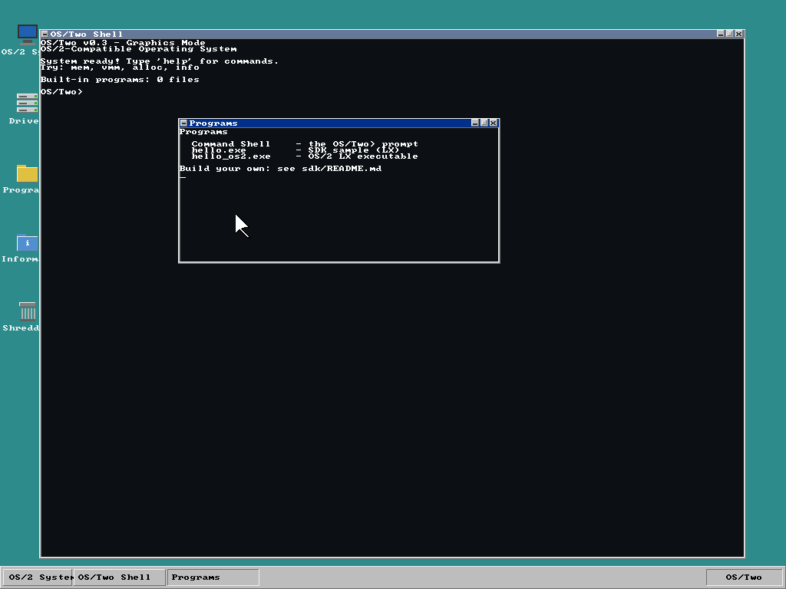

# OS/Two — an OS/2-compatible OS that also runs 64-bit apps

**OS/Two** is an open-source, from-scratch operating system that runs **genuine
OS/2 applications**, runs **native 64-bit programs**, and presents a
high-resolution **OS/2 Workplace Shell** desktop. It's a modern take on OS/2:
the classic look and binary compatibility, on a clean kernel — with a 64-bit
edition that runs OS/2 apps in compatibility mode, exactly the way OS/2 itself
ran 16-bit apps on its 32-bit kernel.



*The OS/Two desktop at 1024×768×32: teal OS/2 Warp background, double-clickable
object icons, and a folder window in authentic OS/2 chrome.*

> **The source lives in [`OSTWO_2026/`](OSTWO_2026/).**
> Build & run from there — see [Quick start](#quick-start) below.

---

## Highlights

- **Runs real OS/2 apps.** A full **LX (Linear eXecutable) loader** parses
  MZ/LX binaries, loads them at their preferred base, applies internal and
  import relocations, decompresses ITERDATA/ITERDATA2 pages, and resolves
  `DOSCALLS` imports to kernel syscalls. It runs actual **Open Watcom-built
  OS/2 executables**, up to full C-runtime programs using `printf`, `fopen`,
  file I/O and `argv`.
- **Runs native 64-bit apps.** The 64-bit kernel boots to x86-64 long mode and
  loads/executes **GCC-compiled ELF64 binaries** in ring 3.
- **Both worlds, one kernel.** The 64-bit kernel runs the **byte-identical
  OS/2 LX apps** in 32-bit compatibility mode.
- **High-resolution OS/2 desktop.** 1024×768×32 out of the box (no GRUB ISO
  needed), styled like the OS/2 Warp **Workplace Shell** — teal desktop,
  object icons you double-click to open folders, and OS/2 window chrome
  (system-menu box, min/max, beveled frames).
- **A real SDK.** Write your own apps in C with the OS/2 API and build them
  into LX executables — see [`OSTWO_2026/sdk/`](OSTWO_2026/sdk/).

---

## Two kernels

OS/Two ships as two kernels that share the same source tree, drivers and OS/2
compatibility layer.

### 32-bit kernel (i386) — the OS/2-compatible desktop OS

- Protected mode, paging (per-process address spaces), ring 0/3 separation
- Preemptive multitasking, threads, semaphores, pipes, message queues
- RamFS + a VFS layer; OS/2-style `DosOpen`/`DosRead`/`DosWrite`/… file API
- PS/2 keyboard & mouse, PIT timer, RTC, serial, PCI, IDE, VirtIO
- **Workplace Shell desktop**: window manager (drag, resize, focus, taskbar,
  start menu) with clickable OS/2 object icons at 1024×768×32
- **OS/2 LX loader** — runs real OS/2 executables (see above)

Build & run:
```bash
cd OSTWO_2026
make           # build kernel.bin
make run       # boot in QEMU
```

### 64-bit kernel (x86-64) — long mode + compatibility mode

- 32-bit multiboot loader + trampoline into **long mode** (PAE 4-level paging,
  `EFER.LME`, 64-bit GDT/IDT)
- Exceptions + IRQs, PIT timer, **`SYSCALL`/`SYSRET`**, ring-3 userspace
- `pmm64`/`vmm64` + an **ELF64 loader** (runs GCC-built 64-bit apps passed as a
  multiboot module)
- **32-bit compatibility mode** (`CS.L=0` + an `int 0x80` gate) that runs the
  same OS/2 LX apps as the 32-bit kernel
- **Preemptive round-robin scheduler** (multiple ring-3 processes)
- PS/2 keyboard **shell** on a framebuffer console, and a PS/2-mouse
  **Workplace Shell desktop** with a window manager

Build & run:
```bash
cd OSTWO_2026
make kernel64      # build ostwo64.bin (needs qemu-system-x86_64)
make run64sh       # interactive shell (type 'gui' for the desktop, 'smp' for the SMP demo)
make run64         # load & run a native ELF64 app + an OS/2 LX app (compat mode)
make run64mt       # preemptive multitasking demo
```

---

## Write your own apps — the SDK

[`OSTWO_2026/sdk/`](OSTWO_2026/sdk/) is a small application SDK. Programs are
ordinary C, built into genuine OS/2 LX executables that run on both kernels.

```c
#include <os2.h>

int main(void)
{
    os2_print("Hello from an OS/Two application!\r\n");
    DosBeep(880, 120);
    return 0;
}
```

```bash
cd OSTWO_2026/sdk
export WATCOM_BIN=/path/to/open-watcom/binl64
./build-app.sh examples/hello.c        # -> examples/hello.exe
python3 embed-app.py examples/hello.exe > hello_bin.h   # embed into the kernel
```

The SDK ships `os2.h` (the OS/2 control-program API), a build script, an
embedding tool, and worked examples (`hello`, `fileio`, `clock`) with a
[full tutorial](OSTWO_2026/sdk/README.md).

---

## Prerequisites

- `gcc` with 32-bit support (`-m32`), `nasm`, `ld`, `make`
- `qemu-system-i386` (32-bit) and `qemu-system-x86_64` (64-bit)
- For building OS/2 apps: **Open Watcom v2**
  (<https://github.com/open-watcom/open-watcom-v2>)

On Fedora/RHEL:
```bash
sudo dnf install gcc glibc-devel.i686 nasm make qemu-system-x86
```
On Debian/Ubuntu:
```bash
sudo apt install gcc gcc-multilib nasm make qemu-system-x86
```

---

## What "runs OS/2 apps" means (honestly)

OS/Two implements the OS/2 **LX executable format** and a **subset of the OS/2
API**, so be clear-eyed about the scope:

- **Yes:** it runs OS/2 LX executables that stay within the implemented API —
  proven with real Open Watcom-built OS/2 programs, including full C-runtime
  apps doing `printf`, file I/O and `argv`.
- **Partially:** an unmodified 1996 IBM Warp binary (SYSDUMP.EXE from a Warp 4
  CD) *loads and executes* — the loader parses it, decompresses its pages, and
  it runs into and through its C-runtime heap init — but doesn't yet finish,
  because IBM's VisualAge C runtime lays out argv/environment differently than
  the loader currently provides.
- **Not yet:** most shrink-wrapped Warp software. GUI apps need the
  **Presentation Manager**, and text apps typically need the **VIO/KBD**
  subsystems — large OS/2 API surfaces that aren't implemented. OS/Two
  implements a few dozen `DOSCALLS` functions out of OS/2's many hundreds of
  APIs.

In short: OS/Two runs OS/2 *format* binaries and a growing slice of the OS/2
API — not the general Warp catalog. That gap narrows one API at a time. See the
[roadmap](OSTWO_2026/OSTWO_ROADMAP.md) section A.2 for the current status.

---

## Repository layout

```
OS2Code/
├── README.md            — this file
└── OSTWO_2026/          — the live source tree
    ├── boot.asm, kernel.c, ...        32-bit kernel
    ├── lx.c, dos_file.c, syscall.c    OS/2 LX loader + DOSCALLS
    ├── gui.c, vga_gfx.c               Workplace Shell desktop / WM
    ├── boot64.asm, kmain64.c          64-bit kernel (long mode)
    ├── pmm64.c, vmm64.c, elf64.c      64-bit memory + ELF64 loader
    ├── lx64.c, sched64.c, kbd64.c ... 64-bit compat loader, scheduler, drivers
    ├── sdk/                           application SDK + examples
    ├── docs/                          screenshots
    └── OSTWO_ROADMAP.md               phase-by-phase development history
```

---

## Status & history

OS/Two is an early-stage but capable project. The complete, phase-by-phase
development log — from the high-res desktop through the OS/2 LX loader to the
64-bit kernel, compatibility mode, scheduler and Workplace Shell — is in
[`OSTWO_2026/OSTWO_ROADMAP.md`](OSTWO_2026/OSTWO_ROADMAP.md).

**Verified working:** high-res WPS desktop with clickable icons; real
Open Watcom OS/2 executables (incl. full C-runtime programs with file I/O and
argv); native ELF64 apps in ring 3; OS/2 LX apps under the 64-bit kernel in
compatibility mode; preemptive multitasking; keyboard shell and mouse desktop
on both kernels.

**Next up:** disk-backed filesystem (drop in `.exe` files without recompiling),
richer window manager and app windows on the 64-bit desktop, wider OS/2 API
surface, and boot polish (memory-map handoff, higher-half kernel).

---

## Credits & license

Built from scratch, inspired by IBM OS/2 and the teaching traditions of Minix
and xv6. Developed with assistance from Claude (Anthropic). License to be
finalized (MIT/BSD intended) — open source, free to use, modify and distribute.

*OS/Two — where classic meets modern.*
